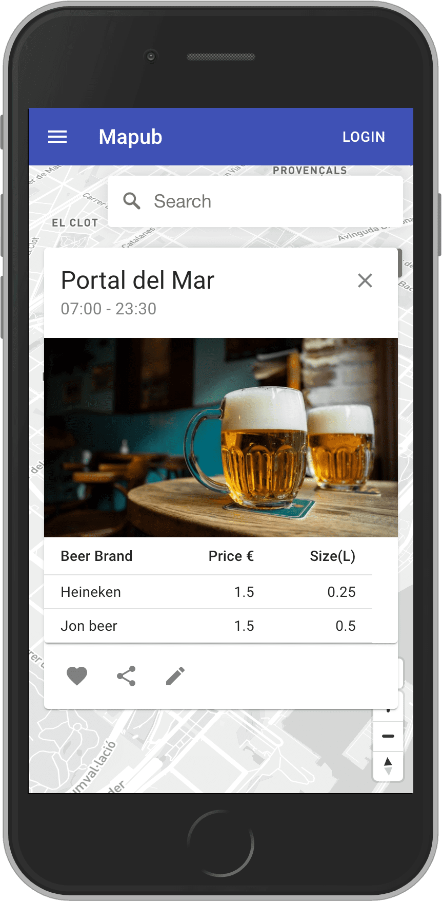

# [Mapub](https://mapub.netlify.app/)
Map app to find the perfect pubs/bars and enjoy your favourite beer at the best price
Check it out at https://mapub.netlify.app/
Cheers!🍻
    
<div>
  
  
</div>    

## 🧪 Want to use this project?
Check, explore and remix it!
<details><summary>See instructions</summary><br>
    
#### 1. Fork and the clone the repository       
#### 2. In the root directoy run `npm run install:all`.       
#### 3. Add your env variables:       
#### 3.1 server --> .env.example (save as .env)     

1. You can create your cluster by signing up at [mongodb](https://www.mongodb.com/cloud/atlas).     
2. Allow connections (whitelist) from your IP or a global IP.    
3. Create a user with read and write privileges. `Security --> Database Access .     
4. Connect --> Connect your application --> Copy the uri  .      

```txt
MONGO_URI=<your mongodb atlas uri>
```
#### 3.2 client --> .env.example (save as .env)

```txt
REACT_APP_MAPBOX_TOKEN=<your mapbox token>
```
1. You can get your token by signing up at [mapbox](https://www.mapbox.com/).

#### 4. In the root directoy run `npm run start:all`.
#### 5. 🚀 Open [http://localhost:3000](http://localhost:3000) to view it in your browser, and start using the app!

</details>

## 🥞 Stack

### Front-End
* React with material ui.
* [React-map-gl](http://visgl.github.io/react-map-gl/).

### Back-End
* Node.js with Express for the server.
* Mongodb Atlas for the cloud database.
     
